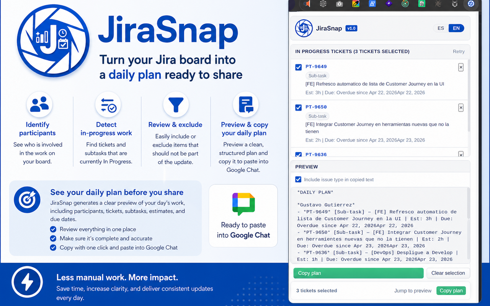

# JiraSnap

<p align="center">
  
</p>

<p align="center"><strong>Turn Jira work in progress into a clean daily plan for Google Chat.</strong></p>

<p align="center">Created by <strong>Ing. Gustavo Gutierrez</strong> — Bogotá, Colombia.</p>

---

## What JiraSnap is for

JiraSnap is a Chrome extension built for people who use Jira every day and need to quickly prepare a professional daily status update.

Its main purpose is to help you:

- identify the people currently involved in work visible on the Jira board,
- detect tickets and subtasks that are in **In Progress**,
- review and exclude anything that should not be included,
- and copy a polished daily-plan text ready to paste into **Google Chat**.

In short, **JiraSnap reduces the manual work of opening Jira, reading active work item by item, and manually writing the daily plan message.**

---

## Objective

The goal of JiraSnap is to make daily planning and reporting faster, clearer, and more consistent.

Instead of manually scanning your Jira board and drafting a message from scratch, the extension helps you generate a structured update directly from the board itself.

This is especially useful when:

- the board is grouped by stories,
- active work lives inside **subtasks**,
- multiple people are assigned across a project,
- and the final update must be shared in a clean, professional format.

---

## Screenshot

### Popup workflow



The popup lets you review participants, inspect active work, control whether issue type should be included in the copied text, and generate the final daily-plan message.

---

## Core capabilities

JiraSnap currently provides the following workflow:

1. **Detects Jira board participants**
   - Reads the Jira assignee filter when available
   - Falls back to visible board cards when needed

2. **Detects active work in the In Progress column**
   - Reads standard Jira cards
   - Handles boards grouped by stories/swimlanes
   - Detects **subtasks inside parent stories or tasks**

3. **Identifies issue metadata**
   - Issue key
   - Summary
   - Estimate
   - Due date
   - Assignee
   - Issue type (Sub-task, Story, Task, Bug, Epic, etc.)

4. **Improves selection before copying**
   - Select one or more participants
   - Exclude tickets individually
   - Reset the selection when needed

5. **Generates bilingual output**
   - Spanish
   - English

6. **Supports cleaner copied output**
   - Optional issue type inclusion in copied text
   - Google Chat-friendly text formatting using `*bold*`
   - No emojis

7. **Improves popup usability**
   - Utility bar with quick actions
   - Sticky action area for fast access to copy/preview actions
   - In-popup overlays for **Instructions** and **About**

---

## Example output

### English

```text
*DAILY PLAN*

*Frontend Team*
- *DEMO-101* [Sub-task] — Refresh the dashboard list automatically | Est: 3h | Due: Apr 22
- *DEMO-102* [Bug] — Fix date validation in the reporting flow | Est: 2h | Due: Apr 23
```

### Spanish

```text
*PLAN DEL DÍA*

*Equipo Frontend*
- *DEMO-101* [Subtarea] — Refrescar automáticamente la lista del dashboard | Est: 3h | Vence: Apr 22
- *DEMO-102* [Bug] — Corregir la validación de fechas en el flujo de reportes | Est: 2h | Vence: Apr 23
```

If you disable the “include issue type in copied text” option, the copied output becomes cleaner and removes the `[Sub-task]`, `[Story]`, `[Bug]`, etc. segment.

---

## How it works

JiraSnap is a **Manifest V3 Chrome extension** that reads the Jira board DOM locally in your browser.

It does **not** call the Jira REST API in the MVP. Instead, it extracts information directly from the board UI using a resilient selector strategy based on:

- `data-testid`
- accessibility labels
- visible board text
- fallback logic for swimlanes and subtask cards

This local approach keeps the extension lightweight and aligned with the real board state the user is seeing.

---

## Supported Jira scenarios

JiraSnap is currently intended for Jira boards hosted on:

```text
https://*.atlassian.net/*
```

It works best when:

- the current page is a board page,
- the board has a visible **In Progress** column,
- Jira renders issue cards in the standard board DOM,
- and participants are visible either in the assignee filter or in the cards themselves.

It is especially designed to handle the scenario where the work in progress is not the parent issue itself, but rather **subtasks inside a story/task swimlane**.

---

## Popup UX features

The popup is designed for quick daily use.

### Main areas

- **Participants** — choose the people whose active work you want to include
- **In progress tickets** — review detected tickets and subtasks
- **Preview** — inspect the final text before copying
- **Sticky actions** — keep copy and preview access easier even when the ticket list is long
- **Help overlays** — open About and Instructions without leaving the popup

### Practical UX improvements already included

- larger JiraSnap logo in the header,
- translated issue type labels,
- option to include or exclude issue type in the copied text,
- better handling for long ticket lists,
- and a preview jump shortcut.

---

## Installation

### Load unpacked extension in Chrome

1. Clone or download this repository
2. Open `chrome://extensions/`
3. Turn on **Developer mode**
4. Click **Load unpacked**
5. Select the `jira-snap/` folder
6. Pin the extension if you want faster access

For a complete local development and unpacked-extension guide, see:

- [`docs/development-setup.md`](./docs/development-setup.md)

---

## How to use JiraSnap

1. Open a Jira board
2. Click the **JiraSnap** extension icon
3. Wait for JiraSnap to detect the board, participants, and active work
4. Select or deselect the relevant participants
5. Review the **In progress tickets** list
6. Remove or uncheck tickets that should not be included
7. Review the generated preview
8. Decide whether to include issue type in the copied text
9. Click **Copy plan**
10. Paste the result into Google Chat

---

## Architecture overview

```text
jira-snap/
├── manifest.json
├── background.js
├── content-script.js
├── popup.html
├── popup.js
├── extractors/
│   └── jira.js
├── docs/
│   └── development-setup.md
├── styles/
│   └── pico-local.min.css
├── images/
│   ├── icon16.png
│   ├── icon48.png
│   └── icon128.png
├── screenshots/
│   ├── screenshot_1.png
│   └── screenshot_2.png
├── _locales/
│   ├── en/messages.json
│   └── es/messages.json
├── jirasnap.png
└── README.md
```

### Important implementation notes

- **Manifest V3** only
- **Local runtime assets only** — no CDN usage in production
- **Content script extraction** from the actual Jira board DOM
- **Storage-based preferences** for language and copied-output options
- **Popup-first workflow** for fast daily use

---

## Permissions used

| Permission | Why it is needed |
|---|---|
| `storage` | Save popup preferences such as language and output options |
| `activeTab` | Access the active Jira tab |
| `scripting` | Support board-side logic under MV3 |
| `host_permissions: https://*.atlassian.net/*` | Restrict access to Jira-hosted boards |

---

## Current limitations

JiraSnap is already useful, but it still depends on Jira’s DOM structure.

Known limitations:

- It relies heavily on Jira `data-testid` and accessibility markup
- Future Jira UI changes may require selector updates
- Some custom Jira issue types may appear with raw names if they do not map cleanly
- Boards with unusual layouts or hidden filters may require retries
- It is intended for board-based workflows, not every Jira screen

---

## Best use cases

JiraSnap is most helpful when you:

- post a daily plan in Google Chat every morning,
- track work mainly from the Jira board,
- work with subtasks under stories or parent tasks,
- need to quickly select only the work that matters today,
- want a consistent, professional daily status message.

---

## Ownership

All project rights belong to:

**Ing. Gustavo Gutierrez**  
Bogotá, Colombia

---

## License

This project is released under the **MIT License**.

See [`LICENSE`](./LICENSE) for details.

---

## Version

Current version: **1.0.0**
